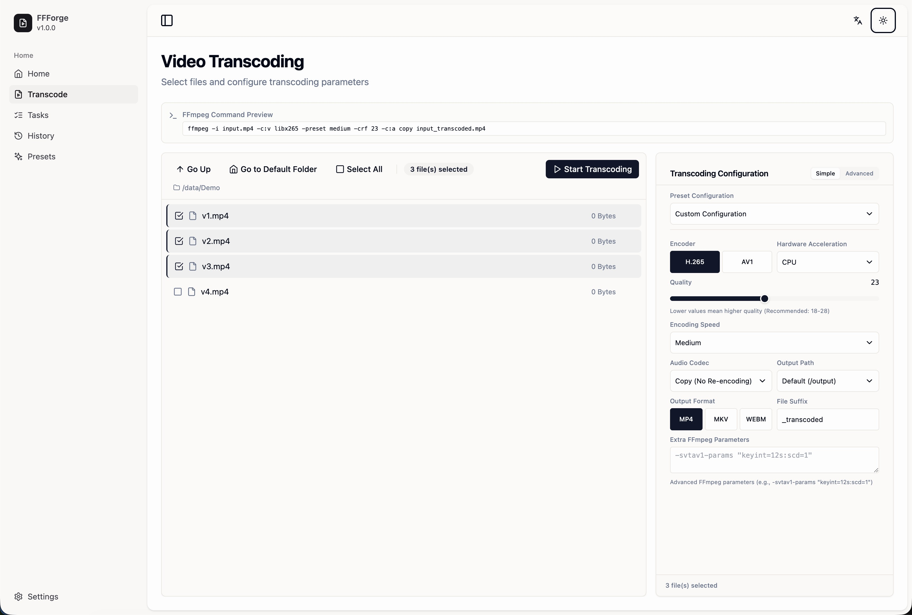
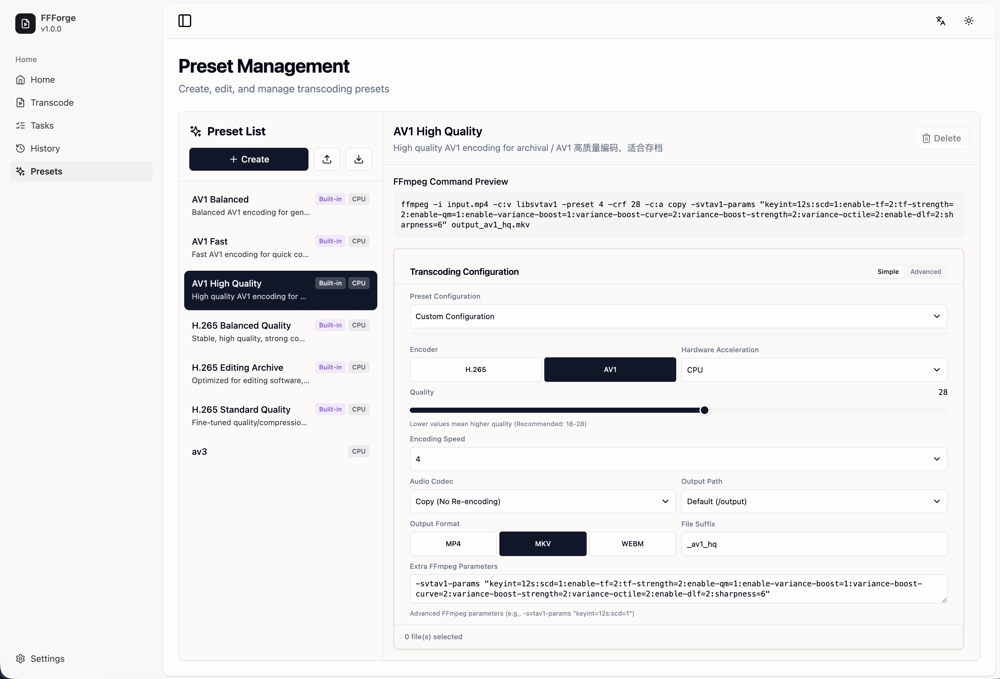

# FFForge

> **!!** This project is under active development. Breaking changes may occur. **!!**

A modern web application for video transcoding with H.265/AV1 encoding support.

[](LICENSE)
[](Dockerfile)


## Features

- Web-based file browser
- Batch processing with real-time progress
- Hardware acceleration (NVIDIA, Intel QSV)
- Customize any FFmpeg command arguments
- Preset management
- Task queue system
- Desktop application (macOS/Windows)

## Roadmap
- [x] File permission management
- [x] NVIDIA GPU Transcoder confirm
- [x] Intel QSV Transcoder confirm
- [ ] Intel QSV / NVIDIA Preset
- [x] Homepage refact
- [x] Desktop application support
- [ ] macOS GPU support
- [ ] AMD GPU support
- [ ] Remote agent transcoding


## Quick Start

### Docker (Recommended)

```
services:
  ffforge:
    container_name: ffforge
    image: channinghe/ffforge:latest
    restart: unless-stopped
    ports:
      - "38110:8080"
    volumes:
      - /your/media/path:/data
      # Mount output directory
      - ./ffforge/output:/output
      # Mount config directory
      - ./ffforge/config:/app/config
    environment:
      - PORT=8080
      # Paths
      - DATA_PATH=/data
      - OUTPUT_PATH=/output
      - CONFIG_PATH=/app/config
      - DATABASE_PATH=/app/config/database/ffforge.db
      - CORS_ORIGINS=http://localhost:3000
    # ============ intel gpu configuration ============
    # if you want to use Intel GPU, uncomment the following:
    # devices:
    #   - /dev/dri/renderD128:/dev/dri/renderD128
    
    # ============ nvidia gpu configuration ============
    # if you want to use NVIDIA GPU, uncomment the following:
    # runtime: nvidia
    # deploy:
    #   resources:
    #     reservations:
    #       devices:
    #         - driver: nvidia
    #           count: all
    #           capabilities: [gpu]
networks:
  ffweb-network:
    driver: bridge
```


```bash
docker-compose up -d
# Access the web interface
open http://localhost:38110
```

### Local Development

```bash
# Backend
cd backend
go run cmd/server/main.go

# Frontend
cd frontend
npm install
npm run dev
```

## Configuration

Mount your video files to `/data` and set output directory to `/output`:

```yaml
volumes:
  - ./data:/data
  - ./output:/output
```

## ScreenShoot



## Hardware Acceleration

### Intel QSV

- ✅ Tested on Linux with Intel Arc Pro B50 (AV1,H265)
- ✅ Tested on Windows with Intel UHD 770 (H265)

Works out of the box with the standard Docker image.

### NVIDIA

- ✅ Tested on Linux with Nvidia P400 (H265)
- ✅ Tested on Windows with Nvidia RTX3070 (H265)

Works out of the box with the standard Docker image.

### AMD

⚠️ Not tested yet

## Tech Stack

- **Backend**: Go 1.22, Gin, SQLite
- **Frontend**: React 18, TypeScript, TailwindCSS
- **Desktop**: Wails v2 (macOS/Windows builds available, more testing needed)
- **FFmpeg**: Powered by [jellyfin-ffmpeg](https://github.com/jellyfin/jellyfin-ffmpeg) with comprehensive GPU transcoding support

> Special thanks to [jellyfin-ffmpeg](https://github.com/jellyfin/jellyfin-ffmpeg) for providing comprehensive FFmpeg builds with GPU transcoding support.

## License

GNU General Public License v3.0 - see [LICENSE](LICENSE) file for details.

This project uses FFmpeg, which is licensed under GPL v2 or later. 
